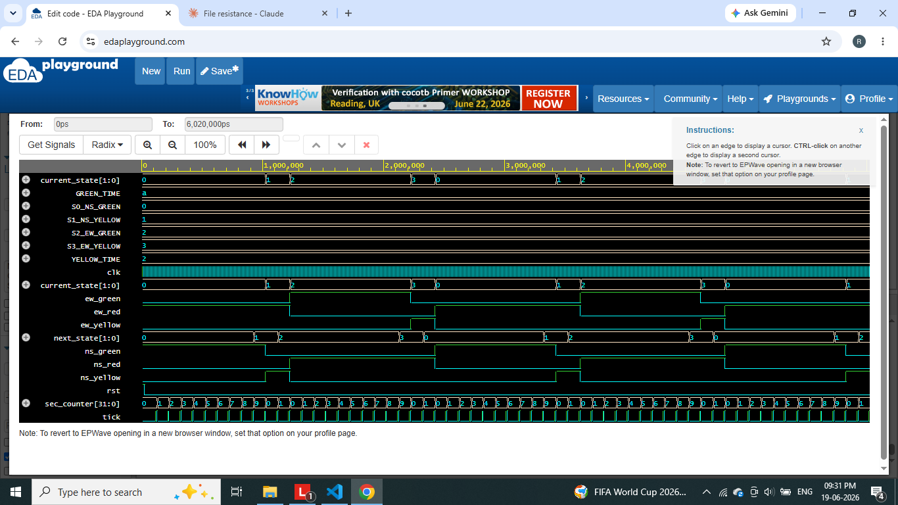

# 🚦 FPGA-Based Traffic Light Controller

A complete Verilog implementation of a synchronous FSM-based traffic
light controller for a two-way intersection — simulated and verified,
with a full Xilinx Vivado synthesis/implementation flow, plus an
interactive Streamlit dashboard for live visualization.

---

## 📌 Overview
This project models a real-world traffic intersection controller using
a 4-state Moore FSM. It demonstrates core VLSI/digital design concepts:
sequential logic, clock division, state machines, and synchronous
output decoding — implemented in industry-standard Verilog and verified
through simulation and the Vivado synthesis/implementation flow.

A Streamlit dashboard is included as a software visualization layer to
make the FSM's behavior easy to demo and interact with — it mirrors the
RTL's state machine and timing exactly, with pedestrian and emergency
override logic layered on top for extra realism.

---

## ❓ Problem Statement
Traffic intersections need predictable, glitch-free, timing-accurate
signal control. This project builds that control logic in hardware-
describable RTL, verifiable through simulation before deployment, and
extendable to real-world scenarios like pedestrian crossings and
emergency vehicle priority.

---

## 🧠 VLSI Concepts Used
- Finite State Machines (Moore)
- Clock division (100MHz → 1Hz)
- Sequential vs combinational logic separation
- Synchronous reset
- Testbench-driven verification
- FPGA synthesis & implementation (Vivado)

---

## 🏗️ Architecture
```
Clock → Clock Divider (1Hz tick) → FSM Controller → Output Decode → LEDs
```

---

## 🔄 FSM Design

| State | NS Light | EW Light | Duration |
|---|---|---|---|
| S0 | Green | Red | 10s |
| S1 | Yellow | Red | 2s |
| S2 | Red | Green | 10s |
| S3 | Red | Yellow | 2s |

State diagram:
```
   ┌────┐  10s   ┌────┐  2s    ┌────┐  10s   ┌────┐  2s
   │ S0 │──────► │ S1 │──────► │ S2 │──────► │ S3 │──────┐
   │NS-G│        │NS-Y│        │NS-R│        │NS-R│      │
   │EW-R│        │EW-R│        │EW-G│        │EW-Y│      │
   └────┘        └────┘        └────┘        └────┘      │
      ▲                                                    │
      └────────────────────────────────────────────────────┘
```

---

## 🛠️ Tools Used
- Verilog (IEEE-1364)
- Xilinx Vivado (synthesis, implementation, simulation)
- Icarus Verilog / EDA Playground (alternative simulation)
- Python + Streamlit (visualization dashboard)

---

## 📁 Folder Structure
```
FPGA-Traffic-Light-Controller/
│
├── rtl/            → synthesizable design files (clock_divider, FSM, top wrapper)
├── tb/              → testbench
├── constraints/     → .xdc pin mapping for FPGA
├── simulation/      → simulation console logs
├── waveforms/       → waveform screenshots
├── dashboard/       → Streamlit visualization app
├── images/          → FSM/architecture diagrams
├── reports/         → Vivado synthesis/implementation reports
├── docs/            → full project report
└── README.md
```

---

## ▶️ How to Simulate (Verilog)

**ModelSim:**
```
vlib work
vlog rtl/*.v tb/*.v
vsim traffic_light_tb
add wave -r /*
run -all
```

**EDA Playground (no install needed):**
1. Go to [edaplayground.com](https://edaplayground.com)
2. Paste all `rtl/*.v` files into the Design pane
3. Paste `tb/traffic_light_tb.v` into the Testbench pane
4. Select simulator: Icarus Verilog
5. Click Run → view waveform in EPWave

---

## 🖥️ How to Run the Dashboard

```bash
cd dashboard
pip install streamlit
streamlit run app.py
```

Opens at `http://localhost:8501`. Features:
- Live FSM cycling through the same 4 states and timing as the RTL
- 🚶 Pedestrian request button (waits for a safe state boundary, then triggers an all-red WALK phase)
- 🚨 Emergency override button (instant flashing red on both directions)
- Real-time countdown, progress bar, and event log

> **Note:** The dashboard is a software visualization for demo purposes.
> The authoritative, hardware-verified design is the Verilog RTL in
> `/rtl`, verified by the testbench in `/tb` and the Vivado flow.

---

## 📊 Sample Waveform


---

## 📸 Screenshots
- RTL code, testbench, waveform, synthesis report — see `images/` and `reports/`
- Dashboard screenshot — see `images/dashboard_screenshot.png`

---

## 🚀 Future Improvements
- Sensor-based adaptive timing (smart intersection)
- Multi-intersection coordination
- Real FPGA board LED deployment with photo/video proof

---

## 🎓 Learning Outcomes
Hands-on experience with FSM design, synchronous RTL coding style,
testbench verification methodology, the full Vivado synthesis-to-
bitstream flow, and building a software visualization layer on top
of a hardware design for demo/portfolio purposes.